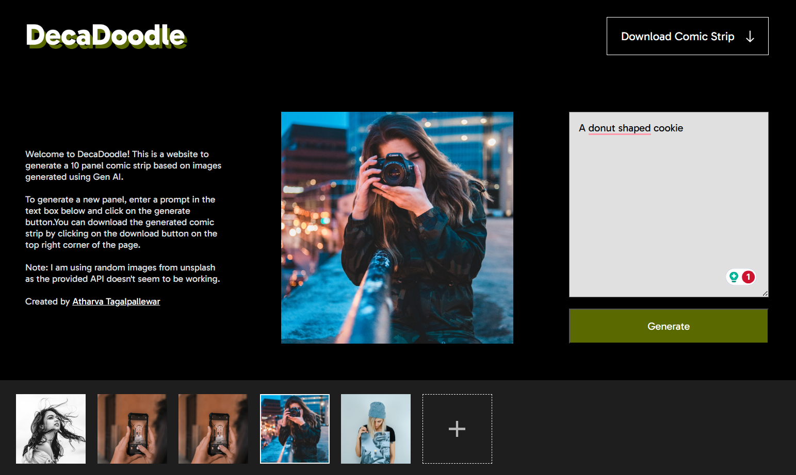

# DecaDoodle: Gen AI powered comic strip generator

DecaDoodle is a web app that generates 10 panel comic strips from given text inputs for each panel. 
You can also download the generated comic strip as a png image.
More features coming soon!

This project is a part of an assignment for [Dashtoon](
https://www.dashtoon.com/)'s recruitment process.

Note: I am using random images from unsplash as the provided API doesn't seem to be working.

## Available Scripts

In the project directory, you can run:

### `npm start`

Runs the app in the development mode.\
Open [http://localhost:3000](http://localhost:3000) to view it in your browser.

The page will reload when you make changes.\
You may also see any lint errors in the console.

### `npm test`

Launches the test runner in the interactive watch mode.\
See the section about [running tests](https://facebook.github.io/create-react-app/docs/running-tests) for more information.

### `npm run build`

Builds the app for production to the `build` folder.\
It correctly bundles React in production mode and optimizes the build for the best performance.

The build is minified and the filenames include the hashes.\
Your app is ready to be deployed!

See the section about [deployment](https://facebook.github.io/create-react-app/docs/deployment) for more information.
